# PDSProject1Report

# BaseLine

## 要求重述

### 实验一 回答这个问题:与文件中的数据操作相比，DBMS 的独特优势是什么？
#### 使用足够大的数据集（我们直接使用平时用的movies和people数据集）将数据同时存储在PostgreSQL数据库表和一个csv文件中 进行两个子实验
##### 1.在 SQL 中使用 SELECT 来查找标题中带有单词“Star”的电影（我们使用DatabaseManipulation类的函数调用SQL），在java实现的FileManipulation类中调用select函数做相同的事，都记录执行时间（我们选择分别在DatabaseManipulation类和FileManipulation类中记录，都在java的Client类里中打印并对比），以体现DBMS的优越性。
##### 2.在 SQL 中使用 UPDATE 将人名中所有的“To”更改为“TTOO”（我们使用DatabaseManipulation类的函数调用SQL），在java实现的FileManipulation类中调用select函数做相同的事，都记录执行时间（我们选择分别在DatabaseManipulation类和FileManipulation类中记录，都在java的Client类里中打印并对比），以体现DBMS的优越性。
### 实验二 回答这个问题: 哪个 DBMS 更好？PostgreSQL 还是 OpenGauss，以及采用什么标准？
#### 由于movies数据集不到10000行可能偏小，我们会选择更大的数据集进行进一步实验
##### 1.进行更大规模数据的复杂查询（我们使用DatabaseManipulation类的函数调用各数据库），都记录执行时间（我们选择在DatabaseManipulation类），同理打印并对比，我想我们应该要体现特化了的Opengauss的一些优点。
##### 2.在这个部分分析“数据重组”创建索引的价值
#### 在有条件的情况下 使用尽可能大的数据集

## 思路整理

### BDMS(Database Manage System)的优势是什么呢？我结合已知和自己的经验提几个想法:
1. 并发的使用 利用有限的cpu(gpu)可以大大减少IO的等待时间 而对于联网服务器的很多情形 调取更多的gpu可以全面提升速度
2. 缓存的运用 根据使用频率（我注意到DataGrip的提示中有上下箭头表示使用频率的标志） 可能数据库在后台类似于类似于@cache的装饰符进行了缓存提速
3. 适配的数据结构 在我自己做着玩儿的一个'cmd'命令行里 我使用了树来存储目录和文件地址 数据库肯定做的更好
4. 多用户操作和权限的管理 安装opengauss时发现没有导入任何数据的数据库里是有表格的: 用户表（有用户名密码权限等）当然这和性能关系可能不那么大
5. 可能的日志 我不太确定PostgreSQL是否要求日志 但是opengauss的日志比较详细（这在安装中提供了很大的帮助）
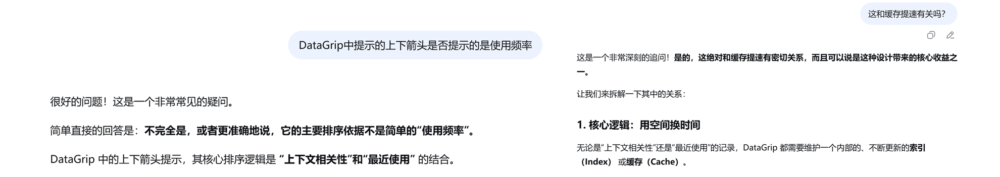
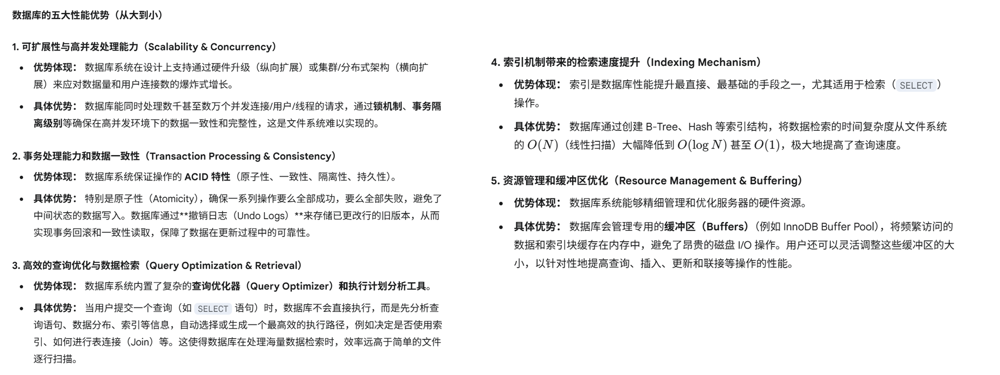
### 经查询验证我的这几个想法 另外:
6. 并发中锁的运用 并发里的锁很让人头疼 但是如果要处理复杂的操作关系 这是绝对必要的（不过这不会在这个实验里体现）
7. 课上提到过 数据库会对命令进行某种"解释"或"编译" 自动替换为更快执行的形式（查询优化器）
### 综上:实验要体现出
1. 并发优势 这依赖于足够大的数据量 以及足够大量的读写（我想update操作会体现出端倪）
2. 缓存优势 我会在进行实验之前对数据库进行"暖机"操作 即多次调用某一数据保证其被缓存（重连数据库清楚缓存可以体现其优化）
3. 查询优化器 我们编写一些逻辑较差的查询来体现查询优化器的作用（课上讲过的两个例子）
4. PSQL和OpenGauss实现的索引机制
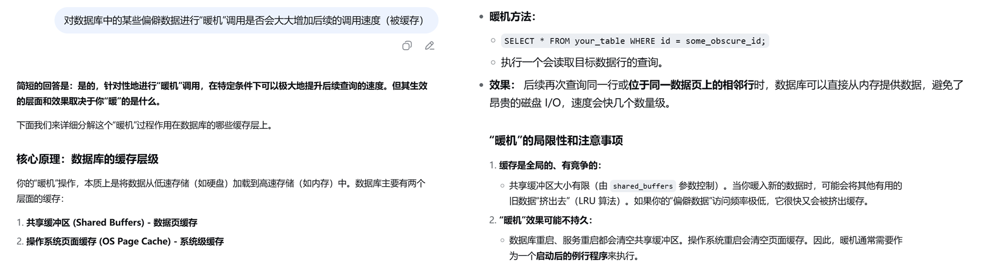

## OpenGauss的优势是什么呢？要体现这种细微优势是有难度的
### 0. 大型数据集
### 1. 超大量的并发
### 2. 复杂逻辑的查询
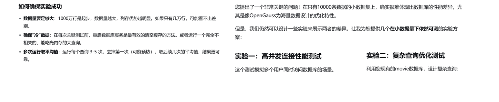
### 3. 索引机制的特化
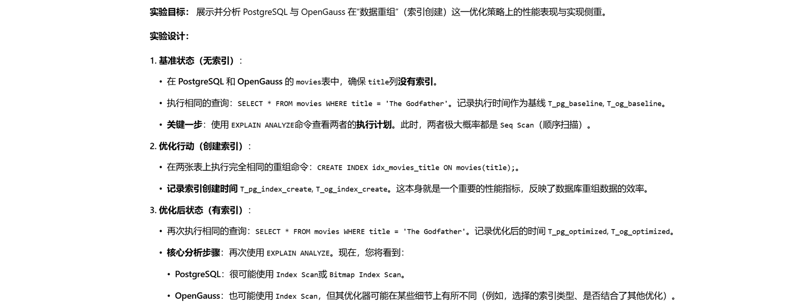

# 实现架构
### 使用了Lab3的code and data项目
### 从华为官网下载了openGauss的驱动.jar包 添加在项目目录下
### 配置了PostgreSQL和OpenGauss数据库导入了课上的基础表
### 从Kaggle上下载了800万行的 纽约出租车数据 并导入数据库
### 划分为四个文件: Size = 8k，80k, 800k, 8M
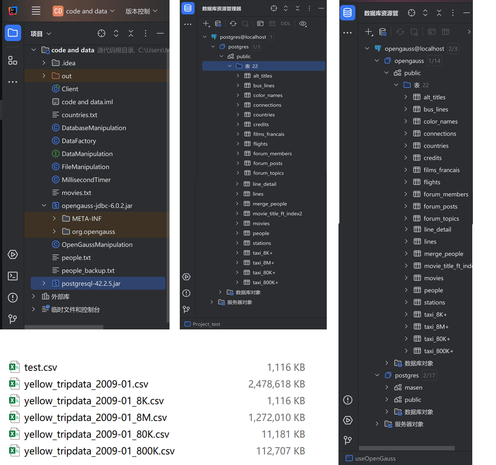

# 代码的设计（接口设计）与实现（示例代码）
## 实验的设计决定了接口框架有哪些方法
### 代码实现里，@retrurn的字符串是方法名称标记和耗时(nm)


```Java
import java.io.IOException;

//
// DataManipulation接口
// 我们在这里定义所有要实现的对照组 并且分别用DatabaseManipulation和FileManipulation实例化
// 最终我们在Client类里调用实验
//
public interface DataManipulation {
    //
    // 支持表的创建和基本功能
    //

    public void bustCache();
    public int addOneMovie(String str);
    public String findMovieById(int id);


    //
    // Design some experiments and try to answer the following questions:
    //

    //
    // Q1. What are the unique advantages of a DBMS compared with data operations in files?
    //

    //
    //       实验1.大批量SELECT实验 检索带有‘XXX’(以Star Wars系列为例)的字符串的电影名称 [体现并发/缓存的优势]
    //            组1.调用数据库查询(暖机) [并发+缓存]
    //            组2.调用数据库查询(清理缓存)  [缓存]
    //            组3.调用Java代码查询    [什么都没有]
    //       预期: 组1最快 组2略慢 组3慢很多(由数据规模决定)
    //

    public String findMovieByTitleStrict(String title);
    public String findMovieByTitleLike(String like);


    //
    //       实验2.大批量Update实验 将带有‘to’的人名字符串部分替换为'TTOO' [尤其体现并发IO的优势]
    //            组1.调用数据库替换(暖机) [并发+缓存]
    //            组2.调用数据库替换(清理缓存)  [缓存]
    //            组3.调用Java代码替换    [什么都没有]
    //       预期: 组1最快 组2略慢 组3慢很多(比实验1更明显)
    //

    public String updatePeopleNamesTTOO();
    public void refreshTTOO();


    //
    //       实验3.使用课上查询优化器例子中本应较差表现的逻辑查询语句
    //            组1.调用数据库查询(好逻辑)[运用查询优化器]
    //            组2.调用数据库查询(差逻辑)[运用查询优化器]
    //            组3.调用Java代码查询    [执行较好的逻辑]
    //            组4.调用Java代码查询    [执行较差的逻辑]
    //       预期: 组1和2不应该有很大差别 组3慢很多 组4再慢很多
    //

    public String findMovieByConstraintNationAndReleaseYear_usingGoodLogic(String nation, int year1, int year2);
    public String findMovieByConstraintNationAndReleaseYear_usingBadLogic(String nation, int year1, int year2);


    //
    // Q2. Which DBMS is better? PostgreSQL or openGauss, and by which standard?
    //

    //
    //       实验4.大批量SELECT实验 检索带有载有4个人的trip
    //            组1. 8K+
    //            组2. 80K+
    //            组3. 800K+
    //            组4. 8M+
    //       作图: 规模-时间图
    //

    public String findTripOf_n_Passengers(int n, int group);


    //
    //       实验5.大批量Update实验 将trip_distance = d的值设为 -d
    //            组1. 8K+
    //            组2. 80K+
    //            组3. 800K+
    //            组4. 8M+
    //       作图: 规模-时间图
    //

    public String updateDistance_mt_d(int d, int group);
    public String refreshDistance_mt_d(int d, int group);
}
```

# 计时的实现
### 在DataGrip中每条操作记录中有如下时间信息:

### 这并不利于对比
### 我选择直接在Java程序中调取SQL指令，并记录时间(同样是寻找"Star Wars"的代码):

### 这两者的数值足够接近
### 下附这段计时对应的代码
#### 一个Timer类 可以选择用ms或ns计时


```Java
//
// 按毫秒进行计时(后续我换成了纳秒)
//

public class MillisecondTimer {
    private long startTime;
    private long stopTime;
    private boolean isRunning = false;

    public void start() {...}

    public long stop() {...}


    public long getElapsedTimeMillis() {...}

    public long getElapsedTimeNanos() {...}

}
```

#### 在DatabaseManipulation implements DataManipulation类里对每个方法都包装计时


```Java
@Override
    public String findMovieByTitleStrict(String title) {
        getConnection();
        MillisecondTimer timer = new MillisecondTimer();
        timer.start();
        String result = "";
        String sql = "select * from movies where title = " + "?";
        try {
            PreparedStatement preparedStatement = con.prepareStatement(sql);
            preparedStatement.setString(1, title);
            result = "Runtime of this [Database] findMovieByTitleStrict is " + timer.stop() + "ms";
            resultSet = preparedStatement.executeQuery();
            // 余下的打印极其耗时 而且不应该记在DBMS的时间内 因为数据已经打包传出了数据库
            while (resultSet.next()) {
                String str = "";
                str += resultSet.getString("movieid");
                str += ";";
                str += resultSet.getString("title");
                str += ";";
                str += resultSet.getString("country");
                str += ";";
                str += resultSet.getString("year_released");
                str += ";";
                str += resultSet.getString("runtime");
                str += ";";
                //System.out.println(str);
            }
        } catch (SQLException e) {
            e.printStackTrace();
        } finally {
            closeConnection();
        }
        return result;
    }
```

# 基础实验实现和防缓存设计

## **实验1** SELECT * FROM movies WHERE title = 'Star Wars'; 和 SELECT * FROM movies WHERE title LIKE 'Star%';
## **实验方法**


## **实验结果**
## 1-1

## 1-2

## **分析**
### 在我最初的设想里，DBMS系统最大的性能优势应该是源于并发，而缓存(Cache)只是次之。但一些在movies和people上的小实验（这两个表都只有10000行左右的数据）和重复调试代码的过程让我注意到了**随着重复次数的增加**同一查询的执行时间明显依次递减。以找到"Star Wars"这一部电影的查询为例，缓存（重复执行三次）提升了效率**100多倍**，显然DBMS的缓存模块“记住”了这部电影。 
### 相应的，在找到"Star Wars"系列电影时，“记忆”就不那么强烈。
### 现实意义: 这样的例子提醒我们要善于利用Cache机制设计和运用数据库调用
### 该进: 我们也要意识到缓存在重复实验中的毁灭性影响 这是我问什么尝试实现了一个bustCache()函数

## **bustCache()函数**

### 实验往往需要多次取平均，但多次重复操作会让缓存高度“注意”其相关的行和列，一个立刻会有的想法是分散这种“注意力”。
### 我实现了一个bustCache()函数，轮番(做个几十次)对几个不在实验中使用的数据库进行查询，这里具体指，以下是这个函数实现的代码:


```Java
@Override
    public void bustCache() {
        getConnection();
        try {
            String[] queries = {
                    "SELECT * FROM bus_lines WHERE station_id IN (1,2,7,8,12,17,18,28,38,61)",
                    "SELECT * FROM color_names WHERE name IN ('AliceBlue','AntiqueWhite','Aqua','Aquamarine')",
                    "SELECT * FROM station WHERE district IN ('Luohu','Futian')",
                    "SELECT * FROM station WHERE latitude BETWEEN 22.53 AND 22.55"};
            for (int i = 0; i < 30; i++) {
                for (String query : queries) {
                    try (Statement stmt = con.createStatement();
                         ResultSet rs = stmt.executeQuery(query)) {
                        while (rs.next()) {
                            // 读取所有列
                            int cols = rs.getMetaData().getColumnCount();
                            for (int j = 1; j <= cols; j++) {
                                rs.getObject(j);
                            }
                        }
                    }
                }
            }
        } catch (SQLException e) {
            //
        } finally {
            closeConnection();
        }
    }
```

### 效果是有的 但并不明显
### 这里的8%与上图的18%对应
### 对于数据库的复杂性来说这并不足以说明太多（即使这可以复现）
### 这是因为数据库有很大的缓存池 (Cache Pool)
## **Cache Pool**

## 设定缓存池的原则
### DataGrip中的缓存池
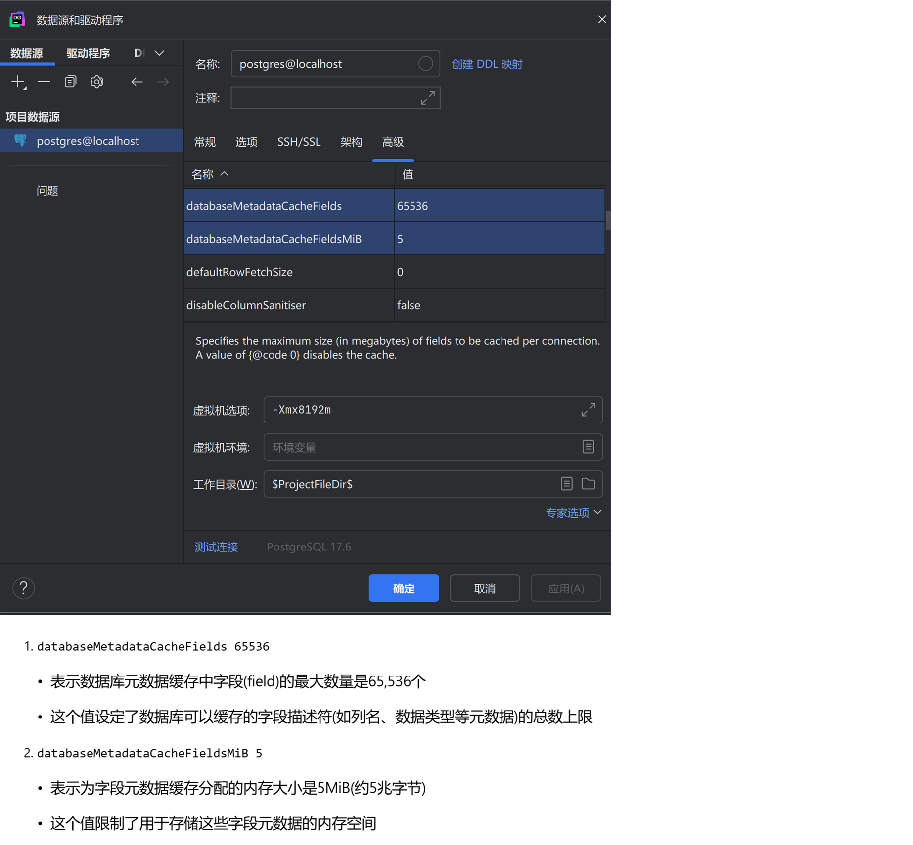
## 数据库缓存池的争抢和Cache()函数的实际使用情况

### 在现实使用中我们往往调用几个表的组合（如movies, people, credits等的组合） 而一个项目里也会有不相关的多个组合同时运作 争抢的程度取决于工程的大小
### Cache函数倒是可以不错的模拟数据库争抢缓存的一般情况
## **Cache()的实际效果**


## 更加稳妥的方案:结合以下四个操作
### 1.断开数据库清除数据库缓存或者执行等价的DataGrip操作


```Java
sudo systemctl restart postgresql
```


### 2.重启 尤其对于JavaIO 由于Windows不支持缓存清除 必须重启

### 3.使用 bustCache() 添加使用场景下的噪声
### 4.设定数据库的缓存池大小（可能不安全）

## **实验2**  UPDATE people SET first_name = replace(first_name,'TTOO','to') WHERE first_name LIKE '%TTOO%';

## **实验方法**

## **实验结果**


## **分析**
### 相较于先前实验，比Java单线程实现提速更多
### 并发操作大大减少了IO等待浪费的时间
### 并发的效果在数据量越大时越明显
### 现实意义: 要有意识的使用多线程读写 这对cpu也没有过多的要求
### 改进: 可能需要更大的数据集 仅仅几毫秒的运行时间 即使有成倍的关系也不足以令人信服

## **实验3** 对比等价逻辑的不同查询
### 这两个查询逻辑被认为在执行时是会等价的
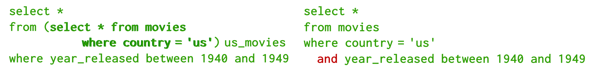
### 让我们来尝试验证一下
### 鉴于后者的逻辑被认为”本应该“更好，命名为GoodLogic，另一个是BadLogic


### 总的来看是差不多的（毕竟他们调用的实际算法是一样的）
## **EXPLAIN [Execution Plan][Query Plan]**
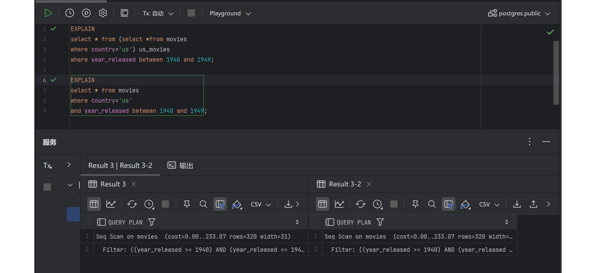
## **EXPLAIN ANALYSIS [Execution Plan][Query Plan]**
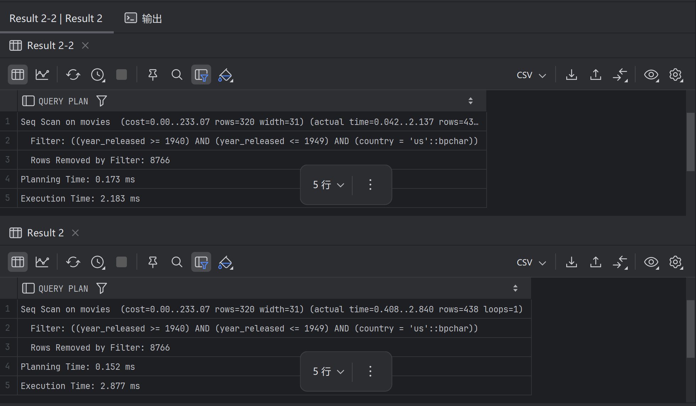
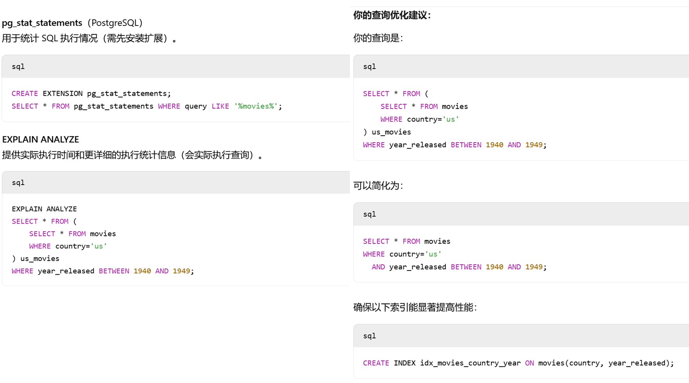
## 排除缓存影响
### 这里分开操作 操作间断开数据库链接并清理缓存
### 否则由于缓存问题先执行的必定慢很多
## **实验方法**
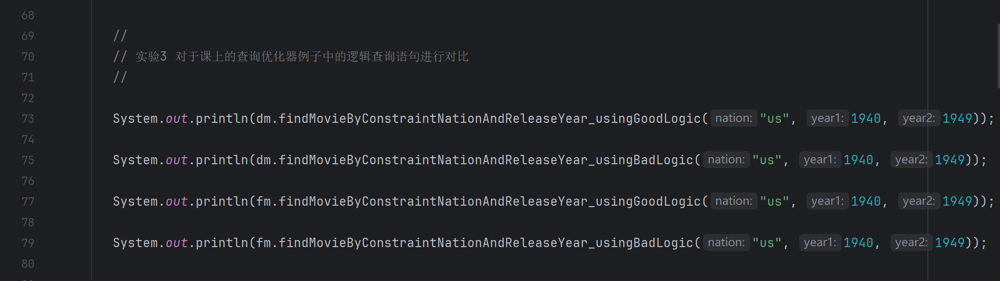
## **实验结果**
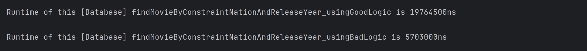

### 那么如果没有查询优化器呢？会怎么样呢？
### 我按照本来的逻辑写了两段Java代码


```Java
@Override
    public String findMovieByConstraintNationAndReleaseYear_usingGoodLogic(String nation, int year1, int year2) {
        
        ...
        
            while ((line = reader.readLine()) != null) {
                String[] movie = line.split(";");
                if (movie[2].equals(nation) && (Integer.parseInt(movie[3]) >= year1 && Integer.parseInt(movie[3]) <= year2)) {
                    //System.out.println(line);
                }
            }
        ...
    }


    @Override
    public String findMovieByConstraintNationAndReleaseYear_usingBadLogic(String nation, int year1, int year2) {

        ...
        
            List<String> selectedContent = new ArrayList<>();
            while ((line = reader.readLine()) != null) {
                String[] movie = line.split(";");
                if (movie[2].equals(nation)) {
                    selectedContent.add(line);
                }
            }
            for (String contentLine : selectedContent) {
                String[] movie = contentLine.split(";");
                if ((Integer.parseInt(movie[3]) >= year1 && Integer.parseInt(movie[3]) <= year2)) {
                    //System.out.println(contentLine);
                }
            }
        ...
    }
```

## **实验方法**
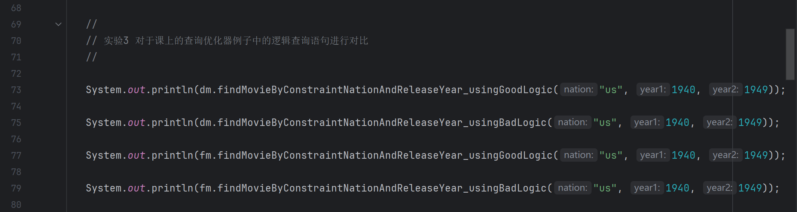
### 同样也必须分开执行 清理缓存
## **实验结果**


## **分析**
### 差距并不大（就单这个查询来看）
### 查询优化器本身需要花费时间
### 这个优化的效果在数据更大时显然会更明显
### 现实意义: 要有意识的审视自己逻辑是否为最佳 有些情况查询优化器可能不会考虑到
### 改进: 可能需要更大的数据集 体现出查询优化器的价值
#

# 实现了更大数据集的实验

#### **后续的实验都是整批完成 实现了缓存清理（每轮重连数据库/重启）**
### 从Kaggle获取数据表8-Million-Lines


### 导入csv
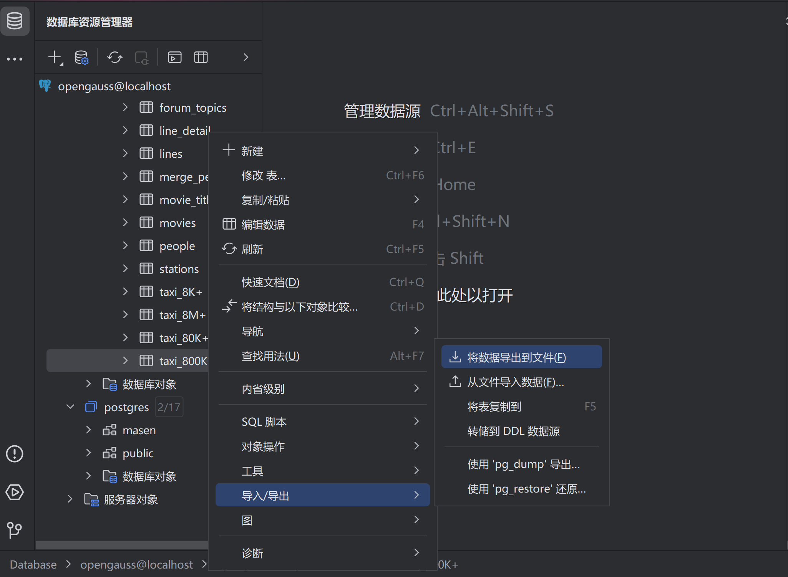
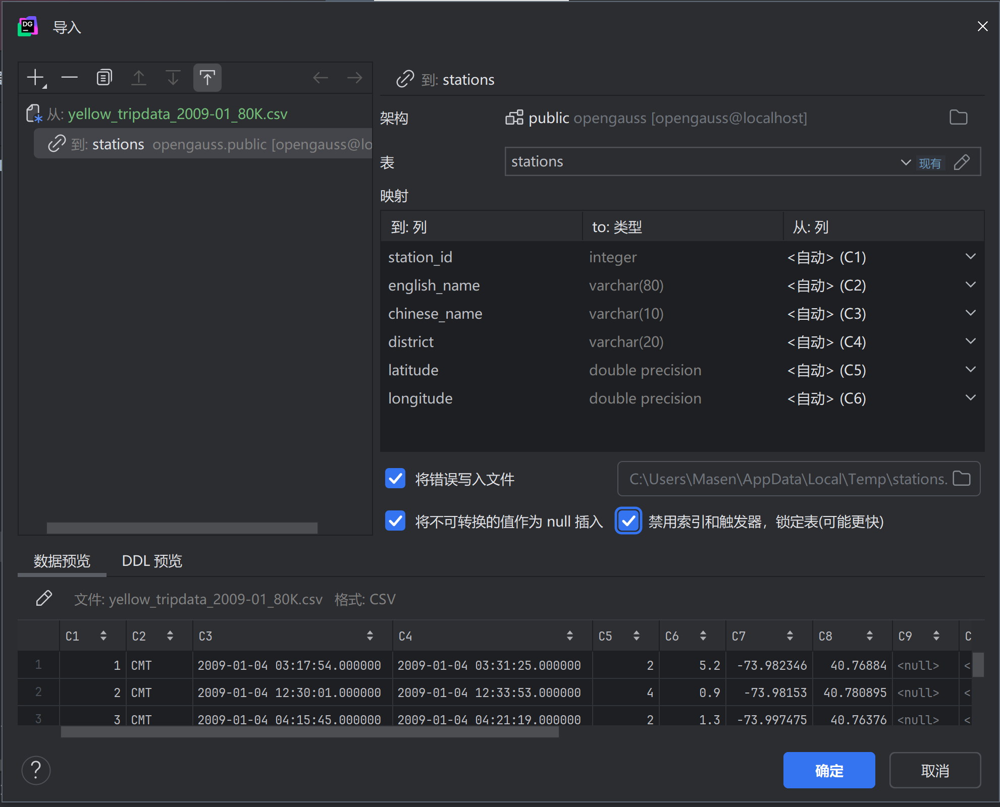
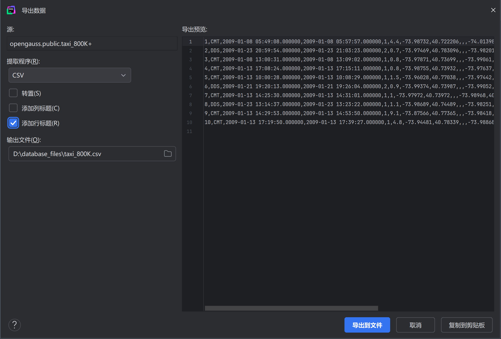

## **\copy COPY 和 pg_dump IMPORT** (在这里走了很多弯路)

## 导入可以使用四种方式
### 直接导入 如上图 要注意先创建有列的表格并一一对应导入 否则会出现失败回滚
### **[bash] \copy** 


```Java
\copy movies FROM '______.csv' WITH CSV HEADER
```

### 具体实现是复杂但可行的


```Java
mm=>
omm=> DROP TABLE IF EXISTS public.taxi_trips;
CREATE TABLE public.taxi_trips (
    vendor_name VARCHAR(10),
    Trip_Pickup_DateTime TIMESTAMP,
    Trip_Dropoff_DateTime TIMESTAMP,
    Passenger_Count INTEGER,
    Trip_Distance DECIMAL(8,2),
    Start_Lon DECIMAL(11,6),
    Start_Lat DECIMAL(11,6),
    Rate_Code INTEGER,
    store_and_forward VARCHAR(10),
    End_Lon DECIMAL(11,6),
    End_Lat DECIMAL(11,6),
    Payment_Type VARCHAR(10),
    Fare_Amt DECIMAL(8,2),
    surcharge DECIMAL(8,2),
    mta_tax DECIMAL(8,2),
    Tip_Amt DECIMAL(8,2),
    Tolls_Amt DECIMAL(8,2),
    Total_Amt DECIMAL(8,2)
);

...
    
omm=> \copy public.taxi_trips FROM '/tmp/yellow_final.csv' WITH (FORMAT csv, HEADER true, NULL '');
omm=> select * from public.taxi_trips where vendor_name = '%DD%';
 vendor_name | trip_pickup_datetime | trip_dropoff_datetime | passenger_count | trip_distance | start_lon | start_lat |
rate_code | store_and_forward | end_lon | end_lat | payment_type | fare_amt | surcharge | mta_tax | tip_amt | tolls_amt
| total_amt
-------------+----------------------+-----------------------+-----------------+---------------+-----------+-----------+-
----------+-------------------+---------+---------+--------------+----------+-----------+---------+---------+-----------
+-----------
(0 rows)
```

### **[SQL] COPY**


```Java
COPY movies FROM '______.csv' WITH CSV HEADER;
```

### **pg_dump**
### 功能和普通Import不同
### 更快更稳定
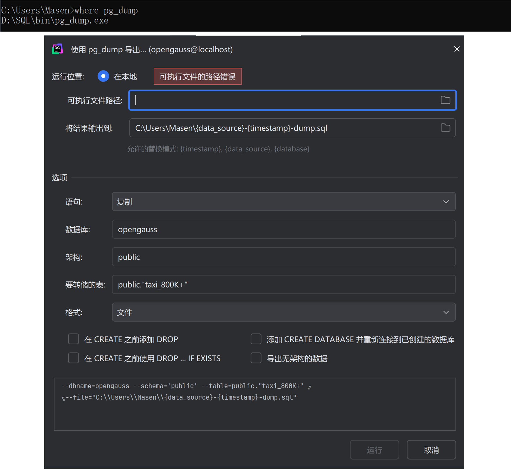

### **关于内存和时间的调整**


### 要导入的数据大小为2GB+
### 默认的750MB填满后就会回滚
### 除了调整内存还需要调整虚拟机供用内存
### 对于运行时间 超时会回滚
### 保证运行时间上限为0（不设限）

## **大批量实验**

## **实验方法**
## 查询实验


## **实验结果**


## **可视化**


## **分析**
### 对于大型数据集 数据库的优秀表现是可以预见的
### 通过并发的优化（控制变量:缓存被及时清理限制了）越大的数据集越倾向于表现出优越的性能
### 相比之下 JavaIO的表现并不差 较为稳定的每10倍时间增加3-5倍
### **并发处理**

## **实验方法**
## 更新实验

## **实验结果**


## **可视化**


## **分析**
### 对于高IO的情况是类似的
## **归因**

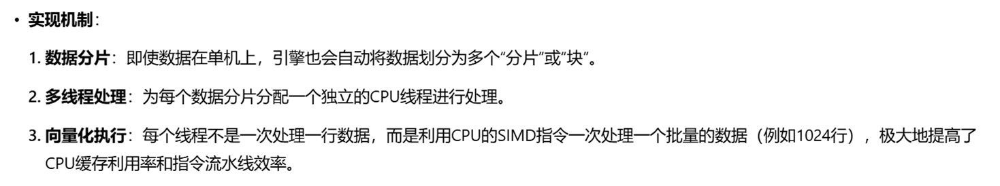

### **分区和索引**


### **分区处理的源代码**
#

# OpenGauss和PostgreSQL的大数据集性能对比

## 一些猜测
### 对OpenGauss了解很少
### OpenGauss对格式/输入/操作质量的要求都远远更高
### 例如OpenGauss不允许使用su用户连接DataGrip
### 例如OpenGauss强制要求su用户有高安全度密码
### 例如OpenGauss提供了系统的日志文件和日志输出（驱动会报红）
### 例如OpenGauss报错了psql不报错的.sql文件

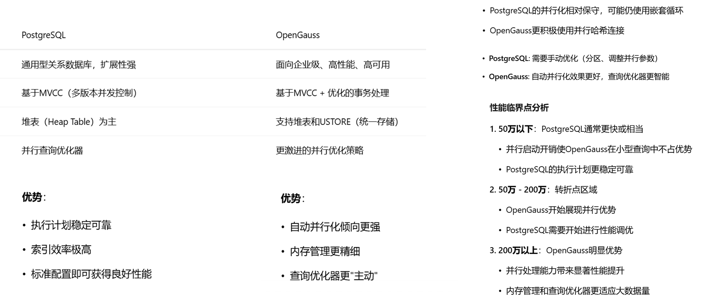

## **实验方法**
## 查询实验

## **实验结果**

## **可视化**

## **实验方法**
## 更新实验

## **实验结果**

## **可视化**
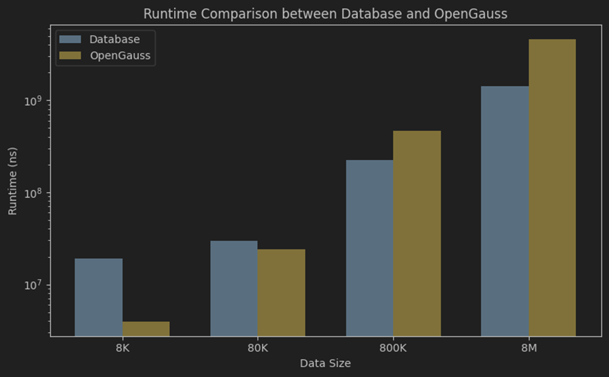
## **分析**
### 课上曾经提及:尽管OpenGauss优化了psql 但是其表现缺常常不如psql
### 就这一实验来看OpenGauss的表现不如psql
### 可能在**更大**的数据上OpenGauss会更好 但是我不打算尝试**更大**的数据集
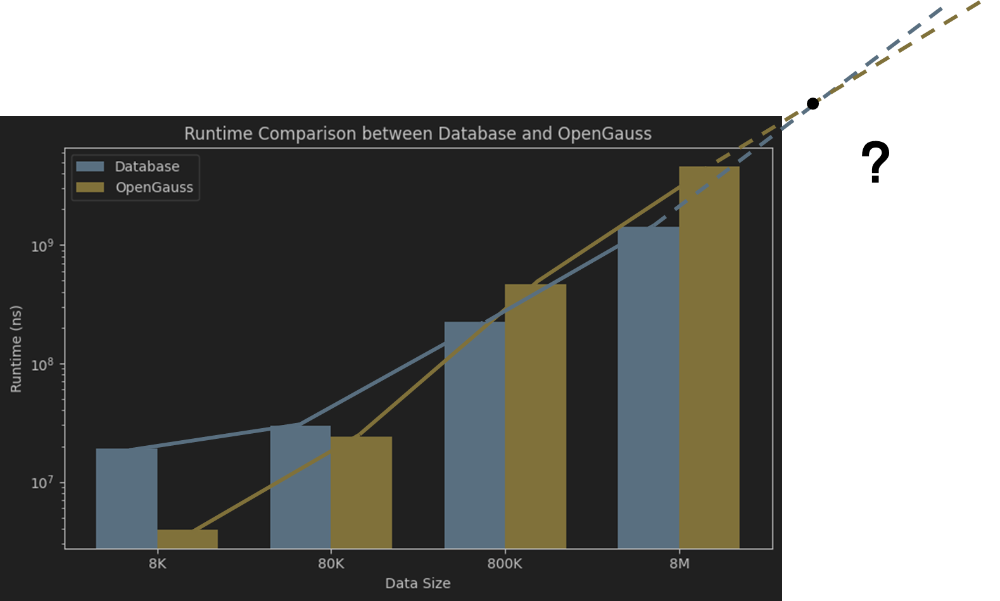
### 在8000万行数据附近 psql还在随着数据集变大而更加胜出
### 这意味着所谓**更大**可能比较遥远
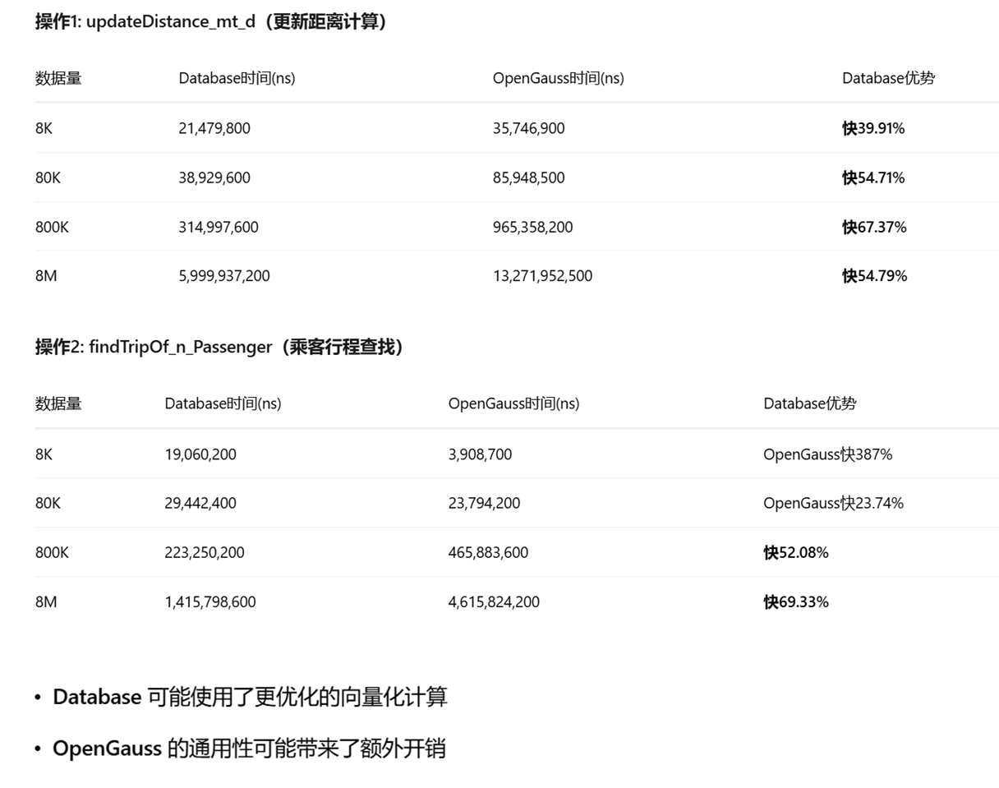
### 我对AI的分析持保留意见
### 我倾向于认为OpenGauss的优化不是在这个场景和方向上努力的 否则它无疑是失败的

# End of BassLine
#### 这一部分耗时5天 导入表花费了我一整天 设计实验和编写代码花费了较多的时间 处理缓存影响的几个尝试无疑是重要的（否则实验无法进行）

# Extra Attempts


